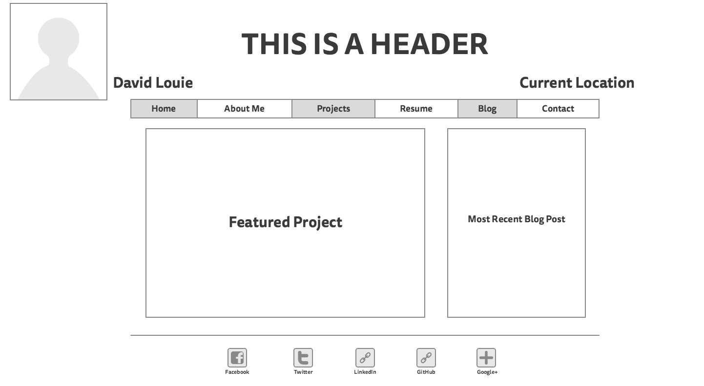
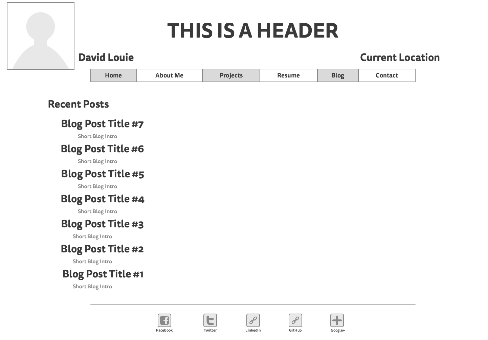

1. What is a wireframe?

A wireframe is a visual representation of what your website will look like.  It helps you define the hierarchy of the pages that will be included on the site.

2. What are the benefits of wireframing?

Wireframing helps you visualize and map out where you're going to put certain pieces of the website such as menus, featured items, and other information.

3. Did you enjoy wireframing your site?

I did enjoy wireframing my site, it gave me a chance to begin to create something that will hopefully become useful to me in my future when looking for a job.

4. Did you revise your wireframe or stick with your first idea?

I generally stuck to my first idea, but with a couple tweaks.  I was initially only going to have individual links to my blog posts with titles, but I decided to put space for an introductory paragraph between the links.  I might even make room for images in the future.

5.  What questions did you ask during this challenge? What resources did you find to help you answer them?

I asked myself on each part of the wireframe if it was a good design or not, so I looked at a few tech blogs to look at what they do to feature their posts.  My design is really simple for now, but I'll be sure to make it more complex when I know how to make it with what we'll be learning in the coming weeks.

6. Which parts of the challenge did you enjoy and which parts did you find tedious?

I enjoyed actually making the wireframe.  It was really easy and straightforward on Mockingbird, and it gave a ton of different options for what elements to put on the page.  I did find the actual formatting of the page to be tedious though.  Even though Mockingbird helps you with the placement of items so they're in line with others, it doesn't help you with sizing so I found that kind of annoying.  Other than that it was a pretty enjoyable experience.

