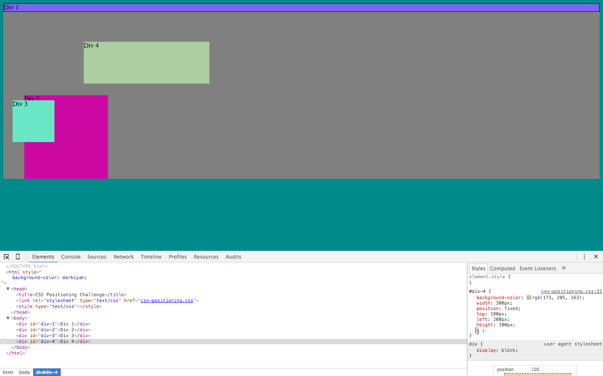
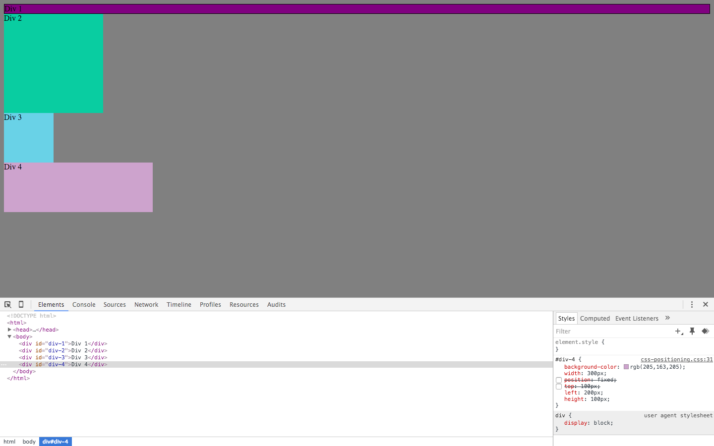
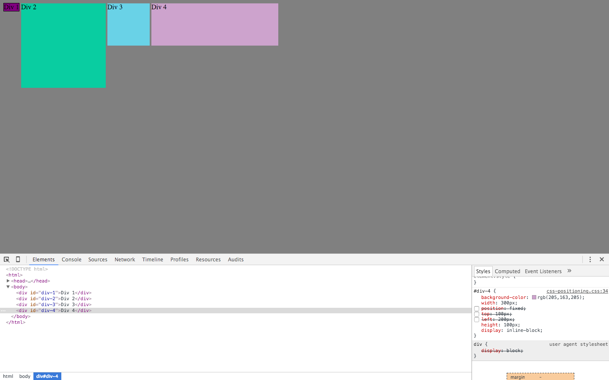
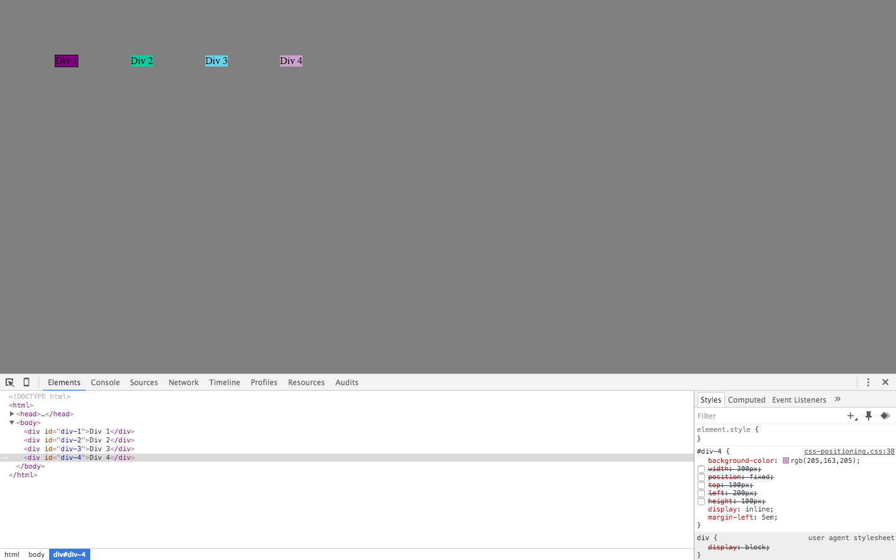
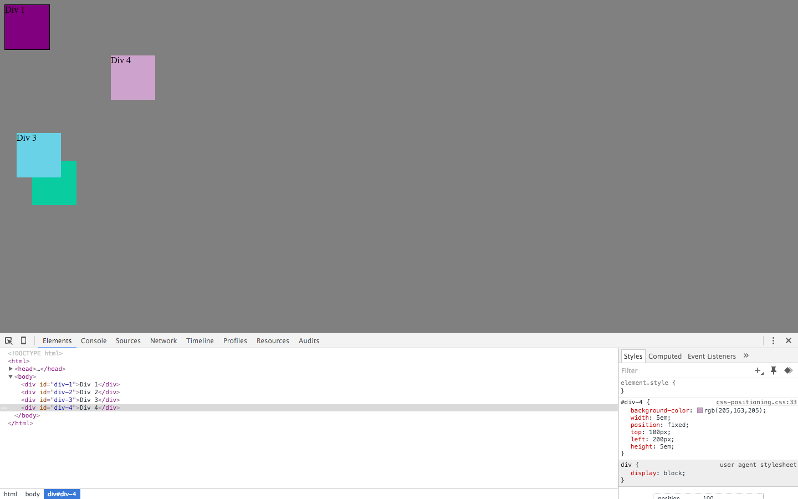
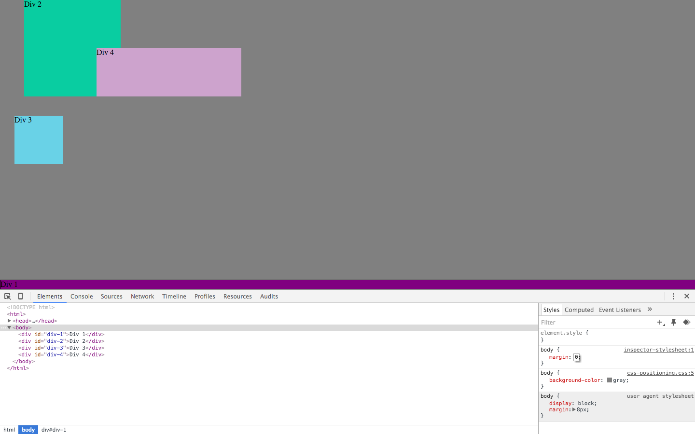
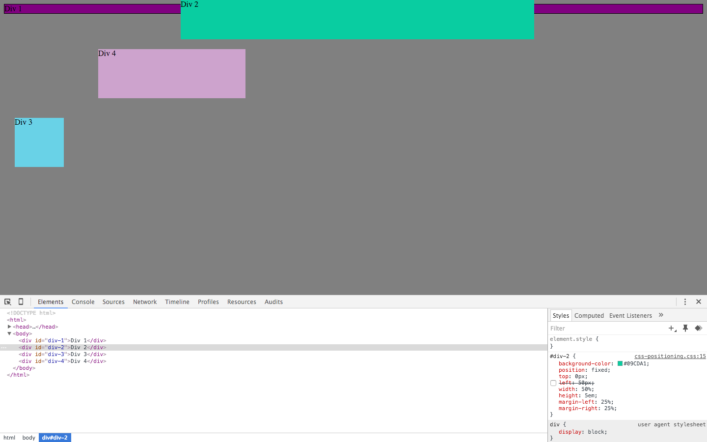
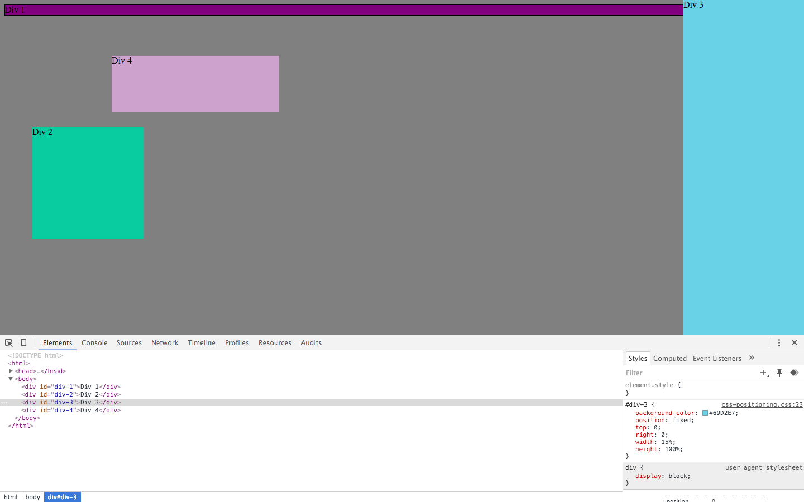
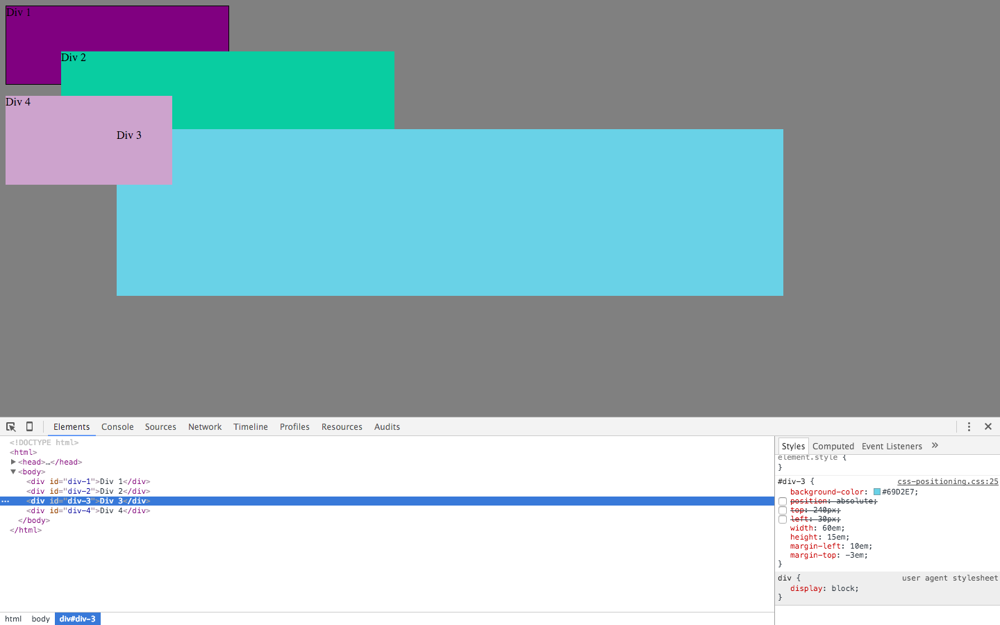

#Pairing Session 3.4 Reflection

###1. How can you use Chrome's DevTools inspector to help you format or position elements?

	The Chrome Devtools inspector helps save a lot of time by allowing you to experiment or change elements without constantly referring back and forth from your HTML and CSS files.  You can make changes, see how it will react, and add it to the final files when you're ready.

###2. How can you resize elements on the DOM using CSS?

	With Chrome Devtools, we were able to resize the elements by clearly defining the desired height and width in the CSS portion of the tools.

###3. What are the differences between absolute, fixed, static, and relative positioning? Which did you find easiest to use? Which was most difficult?

	Absolute positioning produces elements relative to its parent element rather than the entire site.  Fixed positioning anchors an element to the page so that it stays visible at all times.  Static positioning produces elements in the "normal flow" of the page.  Relative positioning changes the position based on the original spot at which it was produced.  Fixed positioning was the easiest for us to use, as it was clearly defined as to where it would go when applying the values.  Relative positioning was difficult because I feel like using static or absolute positioning would have the same utility but without having to figure out where to move from the original point of production.

###4. What are the differences between margin, border, and padding?

	The padding is the space between the content and the border, and the border is the visible end of the element. The margin is the space between elements.

###5. What was your impression of this challenge overall? (love, hate, and why?)

	This challenge gave us some very much needed experience and practice with CSS and using the Chrome Devtools to position our elements before we actually do them.  It was really useful to be able to see how our elements would be manipulated immediately.  This would definitely be useful in the future so we can see how our changes and adjustments to our stylesheets will work before actually applying them.