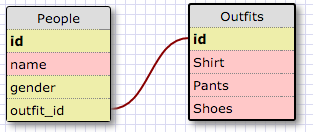

1. SELECT * FROM states;
2. SELECT * FROM regions;
3. SELECT state_name, population FROM states;
4. SELECT state_name, population FROM states;
	ORDER BY population DESC;
5. SELECT state_name FROM states
	WHERE region_id = 7;
6. SELECT state_name, population_density FROM states
	WHERE population_density > 50
	ORDER BY population_density ASC;
7. SELECT state_name FROM states
	WHERE population > 1000000 AND population < 1500000;
8. SELECT state_name, region_id FROM states
	ORDER BY region_id ASC;
9. SELECT region_name FROM regions
	WHERE region_name LIKE '%Central%';
10. SELECT regions.region_name, sates.state_name FROM states
	INNER JOIN regions
	ON states.region_id=regions.id
	ORDER BY region_id;

1. What are databases for?
	Databases store information from programs for future use
2. What is a one-to-many relationship?
	A one-to-many relationship can be seen when one instance of a table element can have multiple instances of one of the other table categories.
3. What is a primary key? What is a foreign key? How can you determine which is which?
	A primary key is generally what is used to be a unique identifier on the table that you're looking at.  A foreign key is an identifier that matches with the primary key of another table.
4. How can you select information out of a SQL database? What are some general guidelines for that?
	Selecting information in a SQL database can be done by using the command SELECT (category) FROM (table).  You can use this to view the information of any single category, or multiple categories.