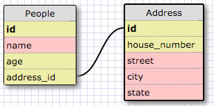
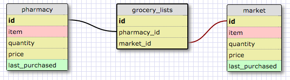

This is a one to one relationship because people have only one home address.

1. What is a one-to-one database?
	A one-to-one database exists where a category in a table correlates to the data in another table.
2. When would you use a one-to-one database? (Think generally, not in terms of the example you created).
	A one-to-one database might be used when the data required by a category needs to be stored in a separate table, rather than on the current table.
3. What is a many-to-many database?
	A many-to-many database exists when categories in a table correlate to data in multiple tables.
4. When would you use a many-to-many database? (Think generally, not in terms of the example you created).
	A many-to-many database might be used in a social media environment, as people have friends who have friends, who have even more friends.  It could be used to view common connections.
5. What is confusing about database schemas? What makes sense?
	Database schemas show what will go into our tables, but what confused me initially was what categories to put into the table and how to relate them in one-to-many or many-to-many situations.